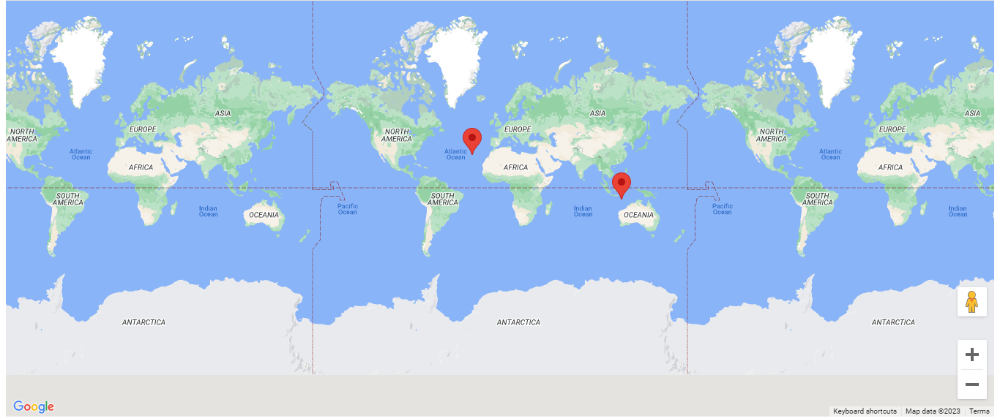

# Maps Navigation

## Table of contents

- [Overview](#overview)
  - [The challenge](#the-challenge)
  - [Screenshot](#screenshot)
- [My process](#my-process)
  - [Built with](#built-with)
- [Available Script](#available-scripts)

## Overview

This is an Map app built to master Typescript by learning popular design patterns and building complex projects. It randomly generates a user and a company which are shown as markers on the google map.

### The challenge

Users should be able to:

- View randomly generated users, with properties like name and location
- View randomly generated companies, with properties like name, catchphrase and location
- See users and companies as markers on the map

### Screenshot



## My process

- Understood the basic syntax of typescript and when to use them.
- Understood different types and their annotations.
- Understood interfaces and building functionalites with classes.
- Generated random data using Faker (User and Company).
- Restricted the amount of API(google map) surface area exposed by creating an instance and making it private.
- Integrated google maps.
- Interpreting type definition files.
- Added marker.
- Refactored code to avoid duplicate.
- Made marker content dynamic.

### Built with

- Typescript
- Parcel
- Faker
- Google maps API key
- React

### What I learned

Creating a type alias, rather than defining same type multiple times

```ts
type Drink: [string, boolean, number];
const coke: Drink =['brown', true, 20];
```

Ensure a value satifies all properties of an interface

```ts
export class User implements Mappable
```

## Available Scripts

In the project directory, you can run:

### `npx parcel index.html`

Runs the app in the development mode.\
Open [http://localhost:1234](http://localhost:1234) to view it in your browser.

The page will reload when you make changes.\
You may also see any lint errors in the console.
